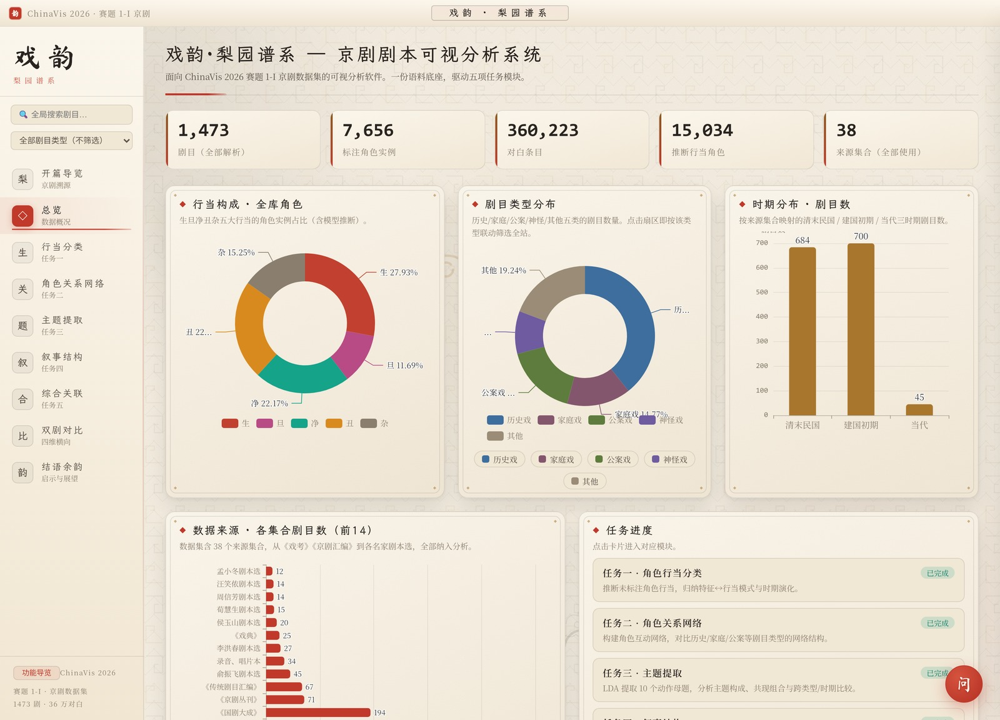
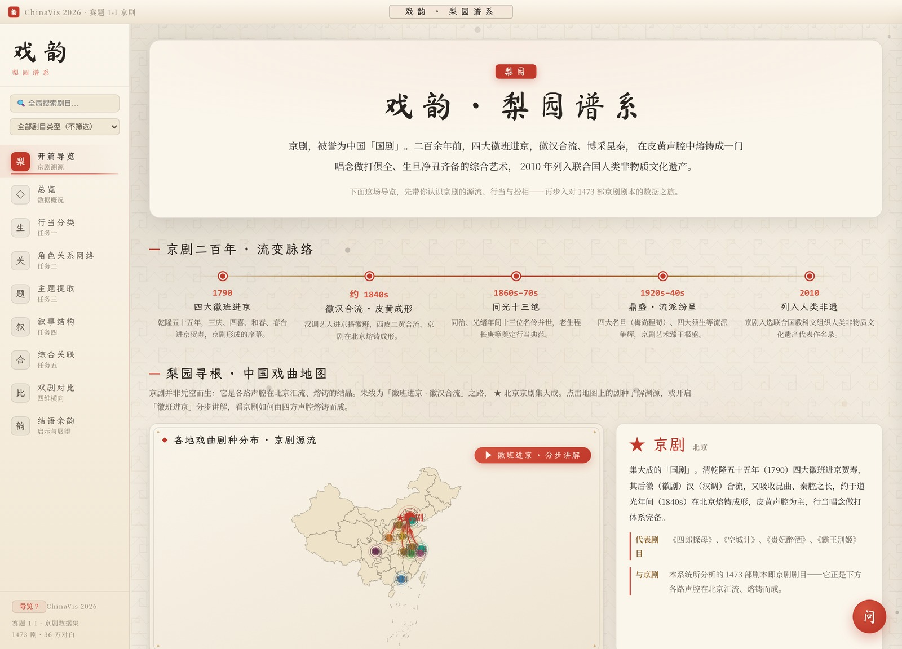
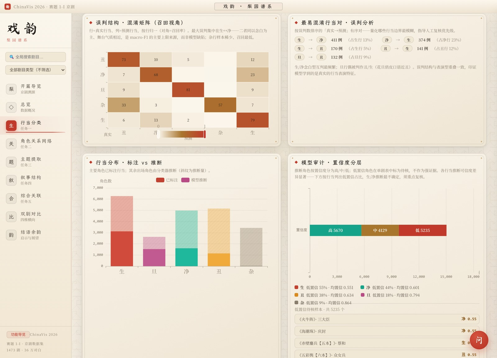
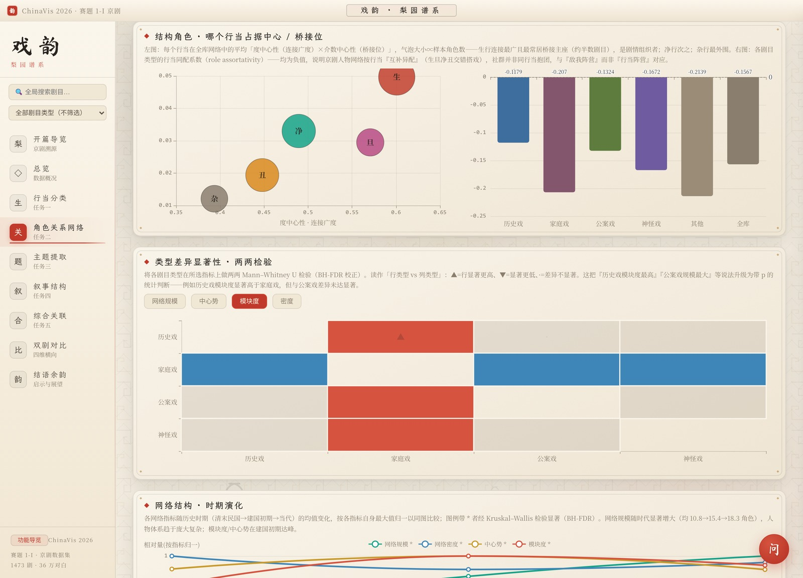
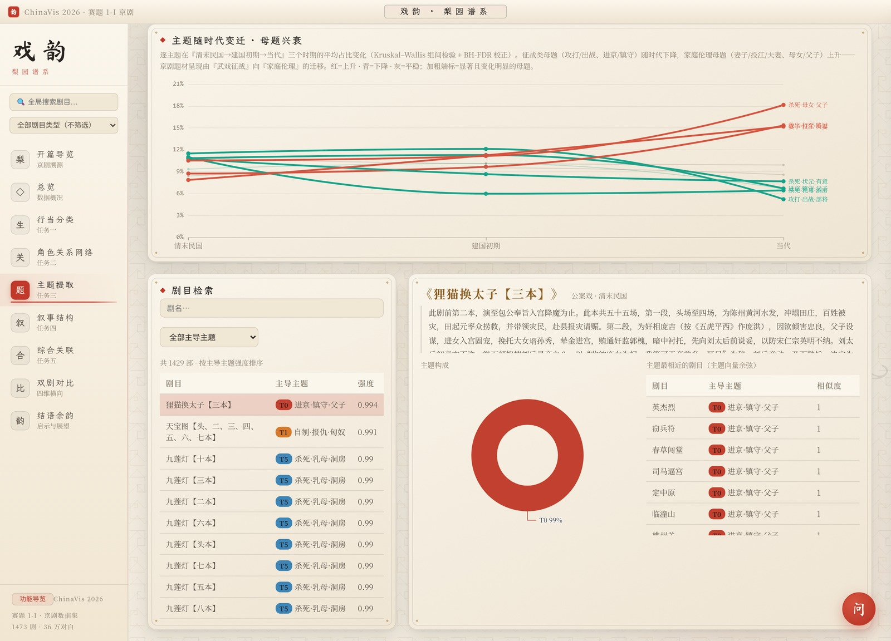
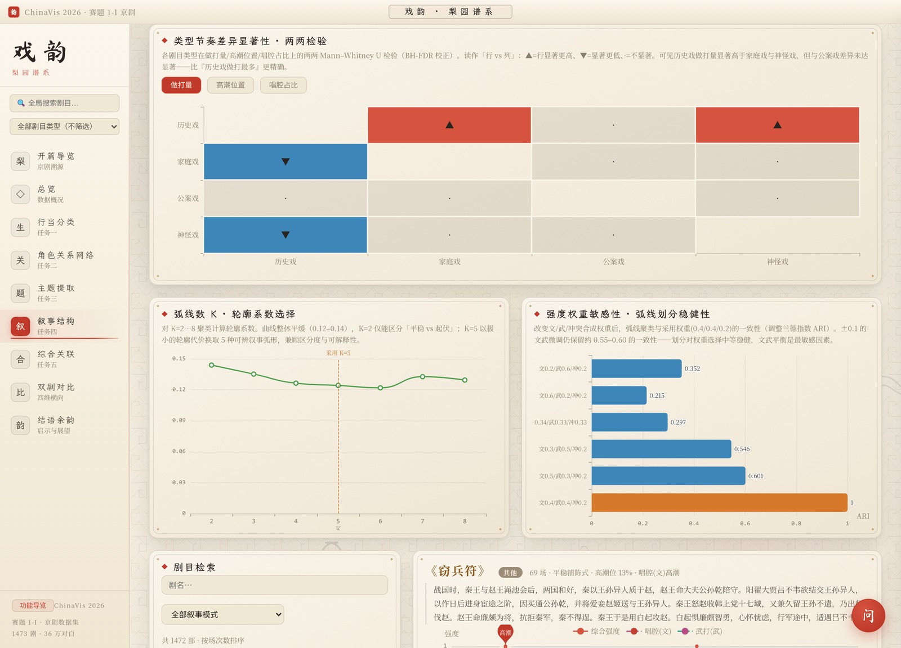
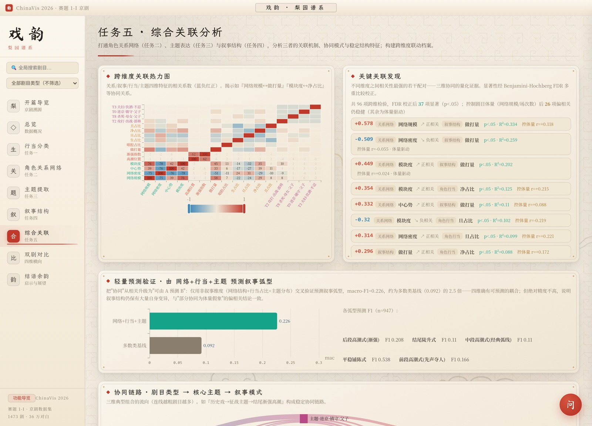
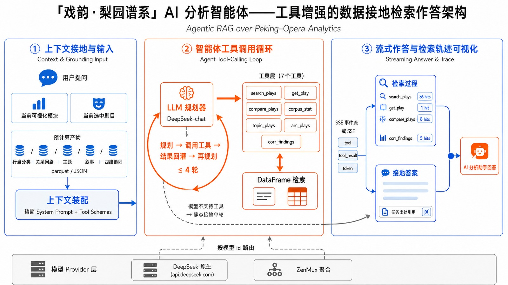

<div align="center">

# 戏韵 · 梨园谱系

**京剧剧本可视分析系统**

**简体中文** · [English](README.en.md)

[](LICENSE)


一套对 **1473 部京剧剧本** 做端到端可视分析的软件：后端用 Python 解析剧本 PDF 并完成五项分析任务，前端用 React + ECharts 提供多模块交互界面。原型面向 ChinaVis 2026 赛题 1-I 京剧数据集。

</div>

<div align="center">
  
  <br><sub>总览仪表盘：全库行当构成、剧目类型与时期分布、数据来源、五项任务进度</sub>
</div>

---

## 下载 · 桌面版（Windows 免安装）

无需安装 Python / Node，下载即用 —— [**前往 Releases 下载**](https://github.com/unumbrela/xiyun-liyuan/releases/latest)

| 文件 | 说明 |
| --- | --- |
| `XiyunLiyuan-1.0.1-x64-portable.exe`（绿色版） | 免安装，双击直接运行 |

后端随应用自动起停。内置一把额度有限的演示 Key，AI 助手可直接体验；也可在设置中改用自己的 DeepSeek API Key。

> exe 未做代码签名，首次运行时 Windows SmartScreen 可能提示「未知发布者」，选择「仍要运行」即可。
> 想自行从源码运行，见下方「快速开始」。

---

## 这个项目是什么

输入是 1473 部京剧剧本的 PDF；系统把它们解析成统一语料，再围绕「角色行当、人物关系、剧情主题、叙事结构、跨维度关联」做五项分析，并把每一项结果做成可交互的可视化界面。

- **一份语料底座**：1473 部剧本全部解析，得到 7656 个标注角色实例、360,223 条对白，统一存为 `corpus.jsonl` + `plays.sqlite`，供全部任务复用。
- **五项分析任务**：行当分类、关系网络、主题提取、叙事结构、跨维度关联，每项配一个前端模块。
- **完整界面叙事**：从「开篇导览（文化背景）」到「五项数据分析」再到「结语（结论汇总）」，左侧导航在九个模块间切换。
- **全局剧目联动**：在侧栏搜索任一剧目设为「当前剧目」，五个任务模块自动联动展示该剧的画像（单一数据源，本地持久化）。
- **数据接地的 AI 助手**：内置工具调用智能体，基于系统已算出的真实指标作答，不脱离数据编造。

---

## 功能模块

系统按「背景 → 分析 → 结论」组织为九个模块：

| 模块 | 内容 |
| --- | --- |
| 开篇导览 | 京剧发展时间线、中国戏曲地图（剧种源流）、生旦净丑行当与扮相、脸谱色彩、唱念做打四功 |
| 总览 | 全库行当构成、剧目类型分布、时期分布、数据来源、任务进度（含 `/api/overview`） |
| 任务一 · 行当分类 | 角色行当分类与推断、置信度审计、混淆分析、细分行当、时期演化 |
| 任务二 · 关系网络 | 同场共现 + 对话邻接建网，按剧目类型对比网络结构，单剧力导向关系图 |
| 任务三 · 主题提取 | LDA 主题建模、主题共现、原型聚类、跨类型/时期比较、相似剧目推荐 |
| 任务四 · 叙事结构 | 逐场戏剧强度曲线、关键阶段识别、典型叙事弧线聚类 |
| 任务五 · 综合关联 | 关系 × 主题 × 叙事 × 行当四维相关、协同链路、综合原型 |
| 双剧对比 | 任选两部剧目做四维横向对比 |
| 结语余韵 | 汇总五维结论、方法边界说明、数据来源致谢 |

---

## 界面预览

<table>
<tr>
<td width="50%"><br><sub><b>开篇导览</b> · 京剧源流时间线与中国戏曲地图</sub></td>
<td width="50%"><br><sub><b>任务一</b> · 混淆矩阵、行当分布、置信度审计</sub></td>
</tr>
<tr>
<td width="50%"><br><sub><b>任务二</b> · 结构角色、类型差异显著性、时期演化</sub></td>
<td width="50%"><br><sub><b>任务三</b> · 主题随时代变迁、单剧主题构成与相似剧目</sub></td>
</tr>
<tr>
<td width="50%"><br><sub><b>任务四</b> · 节奏差异检验、弧线数选择、强度敏感性</sub></td>
<td width="50%"><br><sub><b>任务五</b> · 跨维度相关、协同链路、综合原型</sub></td>
</tr>
</table>

---

## 主要分析结果

每项任务都同时给出结论与方法边界，不夸大模型能力。

- **任务一 · 行当分类**：用逻辑回归对角色实例分类（表演型/结构/画像特征 + 台词 TF-IDF），实例级 5 折 macro-F1 **0.704**，按剧目分组验证 **0.696**，官方四类（生/旦/净/丑）macro-F1 **0.753**；据此推断 15,034 个未标注出场角色，并按高/中/低置信度标记待核样本。混淆分析显示最大误判集中在「生↔净」，与两者同以念白为主、舞台气质相近一致——说明上限来自行当边界本身的模糊，而非模型缺陷。
- **任务二 · 关系网络**：公案戏网络规模最大、中心势最高（围绕清官的星型结构）；历史戏模块度最高（敌我阵营分明）；家庭戏规模最小但密度最高。各类型行当同配系数均为负（全库 **−0.16**），说明社群对应「敌我阵营」而非「同行当抱团」。
- **任务三 · 主题提取**：先剔除人名/道具等实体再做 LDA，数据驱动选出 **10 个动作母题**（征战、忠义复仇、婚姻家庭、断狱等）。征战类母题随时代下降、家庭伦理类母题上升（Kruskal–Wallis + BH-FDR 校正全部显著）。与 NMF、多 seed LDA 做匹配余弦对照，核心母题高度复现。
- **任务四 · 叙事结构**：用唱念做打标记合成逐场戏剧强度曲线，KMeans 聚出 **5 种典型叙事弧线**。高潮多置于后半。历史戏做打量显著高于家庭戏与神怪戏，但与公案戏差异未达显著（两两 Mann–Whitney U 检验）。
- **任务五 · 综合关联**：打通四维度计算相关与协同链路。补充偏相关控制剧目体量后，**行当协同为真**（模块度↔净占比、↔旦占比控制后仍稳健），而「模块度↔做打」实为体量假象（控制后衰减到近 0）。轻量预测验证：仅用非叙事维度交叉验证预测叙事弧型，macro-F1 是多数类基线的约 2.5 倍。

---

## 技术架构

```
pipeline/        数据解析 + 五项分析（Python）
   └── extract → build_corpus → task1..task5 → verify_numbers
data/processed/  产物：corpus.jsonl / plays.sqlite / *.parquet / task*_*.json
backend/         FastAPI，读 data/processed/* 提供 JSON API（network_lib 前后端共用）
frontend/        React + Vite + ECharts，src/modules/ 每个任务一个模块
desktop/         Electron 外壳，把后端与前端打包成独立桌面应用
```

数据流是单向的：`pipeline` 离线算出全部结果存到 `data/processed/`，`backend` 只做读取与按需聚合，`frontend` 通过 API 取数并渲染。这样前端无需重算，启动即用。

**技术栈**：PyMuPDF（PDF 解析）、scikit-learn（逻辑回归 / LDA / KMeans / MDS）、networkx（关系网络）、jieba（中文分词）、scipy（统计检验）、FastAPI（后端）、React + Vite + ECharts（前端）、Electron（桌面打包）。

### AI 分析助手

右下角浮钮打开 AI 助手抽屉，可用自然语言追问系统结论。助手是一个工具调用智能体：后端把已算出的全库指标和当前选中剧目的四维画像拼成上下文，助手按需检索真实数据后作答，并在前端展示检索轨迹。接入 DeepSeek（OpenAI 兼容端点，模型 `deepseek-chat`），未配置 Key 时给出中文提示、不影响其余功能。

<div align="center">
  
</div>

---

## 快速开始

### 1. 环境

```bash
conda create -n llm python=3.11 && conda activate llm
pip install -r requirements.txt
```

仓库已自带 `data/processed/` 产物，可直接启动服务；如需从原始数据重算，见下方「复现数据流水线」。

### 2. 启动（Linux / WSL / macOS）

```bash
./run.sh        # 后端 :8000 + 前端 :5173
```

浏览器打开 http://localhost:5173 。也可分别启动：

```bash
uvicorn backend.main:app --host 0.0.0.0 --port 8000   # 在项目根目录
cd frontend && npm install && npm run dev
```

### 3. 启动（Windows）

安装 Python 3.11+ 与 Node.js 20+，双击 `run_windows.bat`，或在 PowerShell 执行：

```powershell
.\run_windows.ps1
```

脚本会自动创建 `.venv`、安装依赖、启动后端与前端。

### 4. 配置 AI 助手（可选）

```bash
export DEEPSEEK_API_KEY=sk-xxxx        # 或复制 backend/.env.example -> backend/.env 填入
./run.sh
```

---

## 复现数据流水线

从原始剧本重新生成全部产物（任一步失败即停）：

```bash
conda activate llm
cd pipeline && ./run_all.sh
```

等价于按顺序执行：

```bash
python extract.py          # 解压嵌套 zip -> data/raw（修正中文文件名编码）
python build_corpus.py     # 解析全部 PDF -> corpus.jsonl + plays.sqlite + 质量报告
python task1_features.py   # 角色实例特征表 instances.parquet
python task1_classify.py   # 训练 / 交叉验证 / 推断 -> 预测、指标、模式
python task1_subrole.py    # 细分行当分层分类 -> task1_subroles.json
python task1_temporal.py   # 集合到时期映射，行当演化 -> task1_temporal.json
python task2_network.py    # 关系网络指标 + 剧目类型统计 -> task2_*
python task3_topics.py     # LDA 主题提取 + 组合模式 + 跨类型/时期比较 -> task3_*
python task4_narrative.py  # 叙事强度曲线 + 关键阶段 + 弧线聚类 -> task4_*
python task5_synthesis.py  # 四维相关 + 协同链路 + 综合原型 -> task5_*
python verify_numbers.py   # 核查界面引用数字与产物一致（提交前自检）
```

---

## 桌面应用

Electron 外壳把后端与前端打包成独立桌面应用，后端随应用自动起停，无需安装 Python / Node。开发运行与打包见 [`desktop/README.md`](desktop/README.md)：

```bash
cd desktop && npm install && npm run dev   # 起独立应用窗口
```

---

## 目录结构

```
pipeline/        数据解析与五项分析脚本
backend/         FastAPI 服务（main.py / llm.py / agent.py / network_lib.py）
frontend/        React + Vite 前端（src/modules/ 每任务一模块）
desktop/         Electron 桌面封装
data/processed/  分析产物（语料、数据库、各任务 JSON）
docs/            截图与图表生成脚本（make_figures.py / make_diagrams.py）
requirements.txt Python 依赖（版本固定）
run.sh           Linux/WSL/macOS 一键启动
run_windows.*    Windows 启动脚本
```

> 原始数据集 `1-I_opera_dataset.zip` 与 `data/raw/` 体积较大，未纳入仓库；仓库自带的 `data/processed/` 已足以启动系统。

---

## 许可证

本项目以 [MIT 许可证](LICENSE) 开源。
